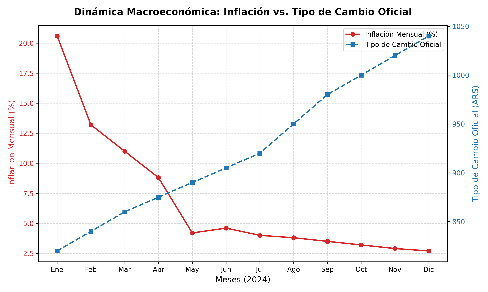

# Inflación y Tipo de Cambio en Argentina 🇦🇷📊

Este proyecto tiene como objetivo estudiar la dinámica macroeconómica argentina reciente, relacionando la evolución de la tasa de inflación mensual oficial con el comportamiento del tipo de cambio oficial (cierre de mes). 

Implementa un flujo completo de **ETL (Extract, Transform, Load)**, almacenamiento local relacional con **SQLite** y representación visual avanzada de doble escala.

---

## 📈 Visualización de Resultados

A continuación se observa la comparativa de doble eje entre la desaceleración de la inflación mensual y la evolución del tipo de cambio oficial:

---

## 🛠️ Estructura del Repositorio

* `etl_inflacion.py`: Script encargado de la extracción y transformación de los datos de inflación.
* `etl_tipocambio.py`: Script para la obtención y normalización de la serie del tipo de cambio oficial.
* `analisis_cruzado.py`: Procesamiento analítico y unificación de las series temporales.
* `grafico_final.py`: Generación de la visualización gráfica de doble escala mediante `matplotlib`.
* `economia_arg.db`: Base de datos SQLite local que almacena los datos estructurados.

---

## 🚀 Tecnologías Utilizadas
* **Python** (Pandas, Matplotlib, SQLite3)
* **SQL / SQLite** (Almacenamiento relacional)
* **Git & GitHub** (Control de versiones y portfolio profesional)
